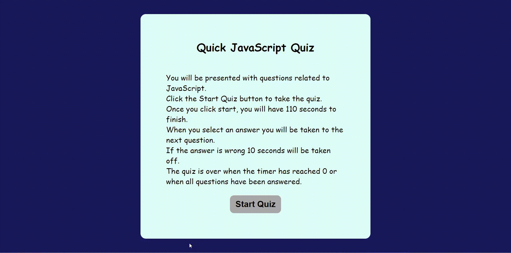

# TimedQuizz

## Description

A quiz app creates with mostly with JavaScript (HTML and CSS were used as well).

The first card explains how the works quiz and a Start button.

When users click the Start Quizz button, they are presented with the first question and are given 110 seconds to complete it.

When select the correct answer, it says "correct!"

When select the wrong answer, it says "wrong!" and ten seconds are deducted from the timer.

Not matter if correct or wrong, once and answer is clicked the quiz moves to the next question.

Once they answer all the questions or the timer is 0 the quiz is over and a card showing their score appear.

In the scores card users can input their initials and that together with the score gets saved to the local storage.

In the scores card users can also view all the scores when click on the view scores button. 

In all the scores card users have the option to re-take the quiz and or clear the local storage information.

Deployed App: https://yemnyfeliz.github.io/TimedQuizz/

## Installation

N/A

## Usage

This app can be used to quickly test basic knoledge on JavaScript.

## Credits

Tutor Andres Jimenez assisted me with the logic of this application.

## License

PLease refer to LICENSE in the repository.

